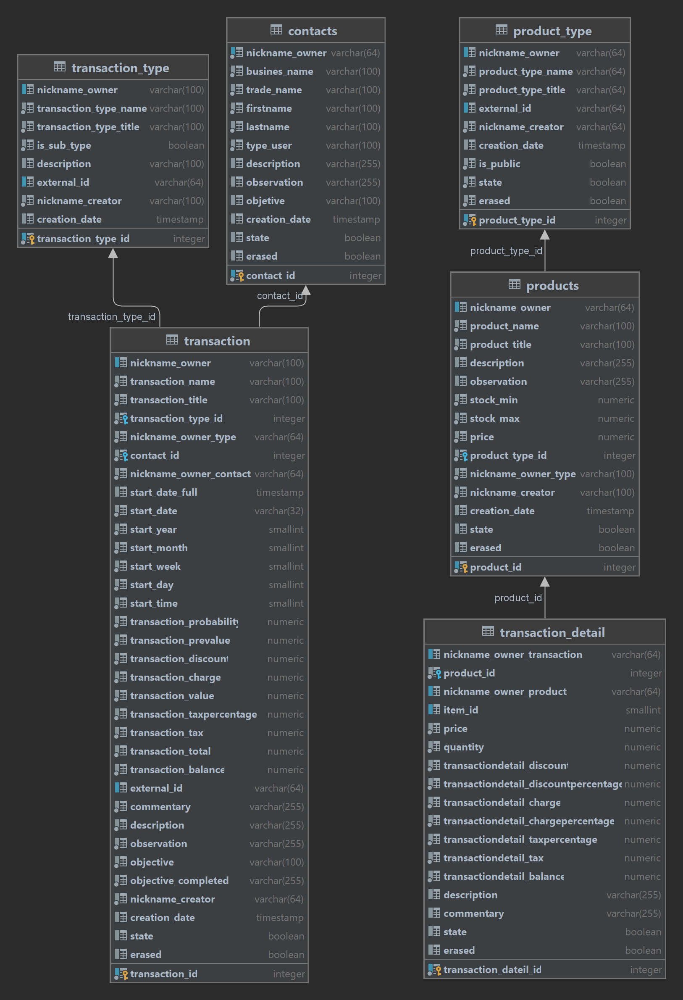

# Disnovo

## Database Test (PL/psql)
- In the test it was created, and I generated the queries raised. 2 queries were not possible because they were not clear and because of the difficulty.

### Use:
- Basic queries
- Views
- Stored procedures (pl/psql)
- BackUp (version control)

## Link directs to its respective file.

## PDF
- This document details from the creation of the user, creation of the database, creation of the tables and the insertion of data in the tables.
- <a href="./disnovo_files/DisnovoTest-KenyiHancco.pdf">PDF</a>   

### Total BackUp
- <a href="./disnovo_files/back_up_dump.sql">Schema and data backup</a> 

### Schema BackUp
- <a href="./disnovo_files/back_up.sql">Schema backup</a> 

### Data
- <a href="./disnovo_files/data.sql">Data</a> 

### Queries
- <a href="./disnovo_files/statements.sql">Queries</a> 

## 1. Schema
